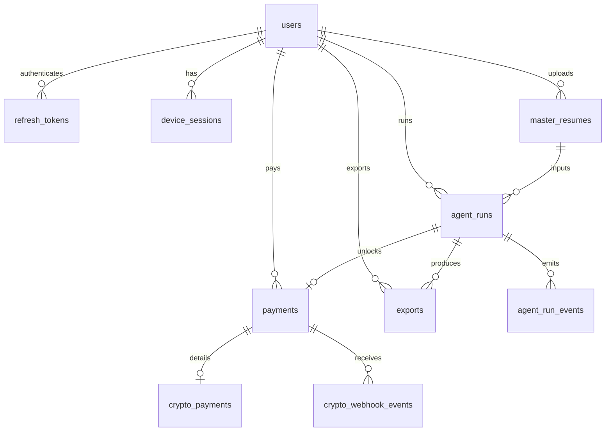

# Database Schema

Auto-generated table documentation. Regenerate after migrations:

```bash
python scripts/db/document_tables.py
bash scripts/db/export_schema.sh
```

## Tables

- [agent_run_events](tables/agent_run_events.md)
- [agent_runs](tables/agent_runs.md)
- [crypto_payments](tables/crypto_payments.md)
- [crypto_webhook_events](tables/crypto_webhook_events.md)
- [device_sessions](tables/device_sessions.md)
- [exports](tables/exports.md)
- [master_resumes](tables/master_resumes.md)
- [payments](tables/payments.md)
- [refresh_tokens](tables/refresh_tokens.md)
- [stripe_events](tables/stripe_events.md)
- [users](tables/users.md)

## Paywall Access Model

There is no separate `access_grants` table in the current schema. Access is derived from:

- `users.free_trial_used` for the one visible free run
- `agent_runs.output_locked` to hide paid-run output before confirmation
- `agent_runs.payment_id` plus `payments.status` to bind confirmed payment unlocks
- `payments.unlocks_uploads` for payment records that unlock additional uploads

## ER Overview


