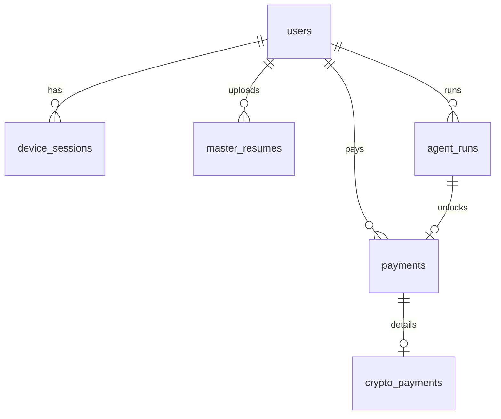

# Database Schema

Auto-generated table documentation. Regenerate after migrations:

```bash
python scripts/db/document_tables.py
```

## Tables

- [agent_run_events](tables/agent_run_events.md)
- [agent_runs](tables/agent_runs.md)
- [crypto_payments](tables/crypto_payments.md)
- [crypto_webhook_events](tables/crypto_webhook_events.md)
- [device_sessions](tables/device_sessions.md)
- [exports](tables/exports.md)
- [master_resumes](tables/master_resumes.md)
- [payments](tables/payments.md)
- [refresh_tokens](tables/refresh_tokens.md)
- [stripe_events](tables/stripe_events.md)
- [users](tables/users.md)

## ER Overview


