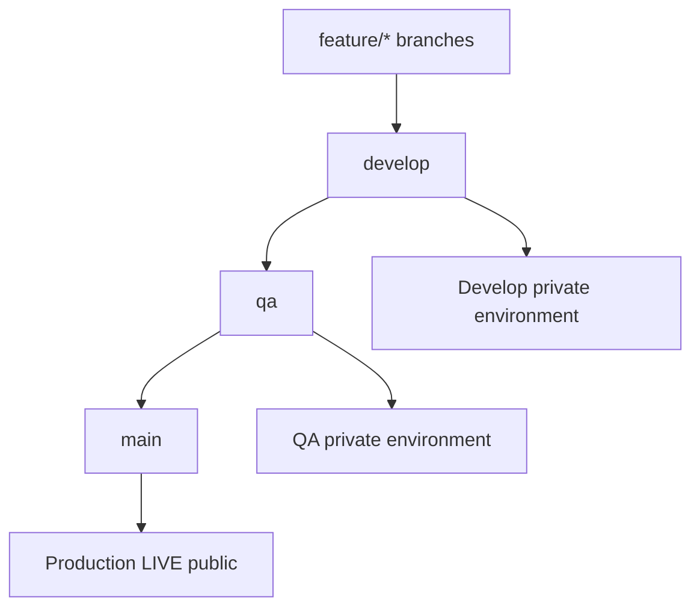
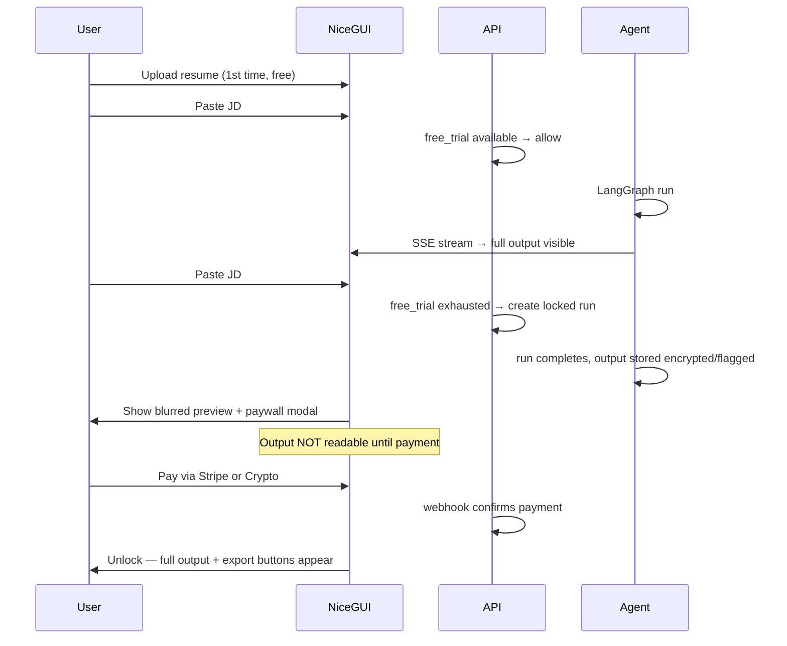
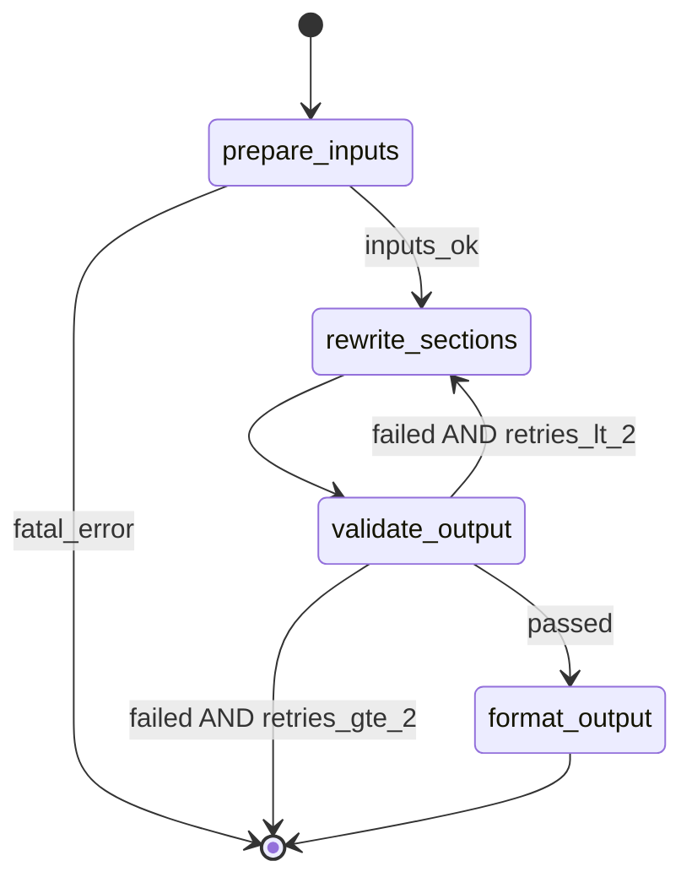
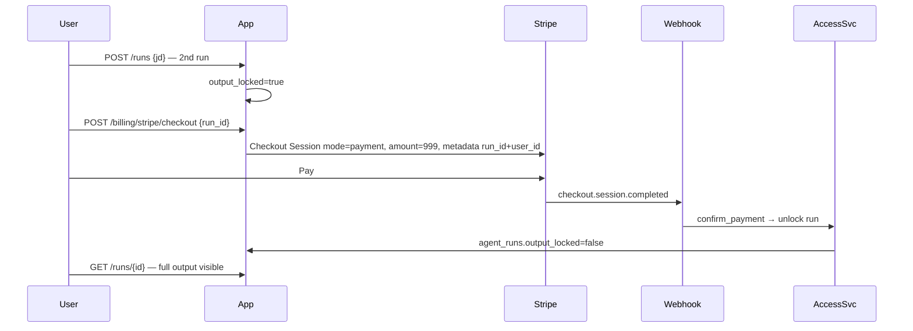
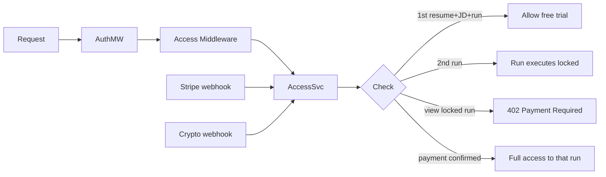

# Resume Builder — Final Production Engineering Plan

## 0. Branch Strategy and Repository Governance (NEW)

### Branch hierarchy



| Branch | Purpose | Deploy target | Public? |
|--------|---------|---------------|---------|
| `feature/*` | Single feature/fix; branched from `develop` | None (CI only) | No |
| `develop` | Integration branch for active dev | `dev.resume-builder.internal` | **No — private** |
| `qa` | Pre-prod validation | `qa.resume-builder.internal` | **No — private** |
| `main` | **Production only — always live** | `app.resume-builder.com` | Yes (app URL public) |

### Promotion gates (every step requires green CI)

| Promotion | Required checks | Approvals |
|-----------|-----------------|-----------|
| `feature/*` → `develop` | lint, mypy, unit + integration tests, 85% coverage, migration doc check | 1 reviewer |
| `develop` → `qa` | all above + E2E agent tests + Docker build + deploy to QA + QA smoke tests | 1 reviewer |
| `qa` → `main` | all above + forbidden-paths guard + prod migration dry-run + manual approval | 2 reviewers + manual workflow dispatch |

**Rule**: Never commit directly to `main`. Never merge `develop` → `main` in one step — always `develop` → `qa` → `main`.

### Dev-only files — committed on non-main branches, NEVER on `main`

These files **must exist** on `develop`, `qa`, and `feature/*` for smooth AI-assisted development, but **must never land on `main`**:

```
docs/dev/
├── claude.md              # Claude Code context
├── codex.md               # Codex context
├── cursor.md              # Cursor agent context
└── plans/                 # Engineering plan documents
    └── *.plan.md
.agents/                   # Optional agent skill overrides (dev only)
```

**Enforcement (three layers)**:

1. **`.gitignore` on all branches**: `.env`, `.env.*`, `!.env.example`, `secrets/`, `*.pem` — secrets never committed anywhere
2. **CI job `forbidden-paths-guard`** (runs on every PR targeting `main`):
   - Fail if changed files match: `docs/dev/**`, `.agents/**`, `**/*.plan.md`, `claude.md`, `codex.md`, `cursor.md`, `.env`, `.env.*` (except `.env.example`)
3. **Promotion script `scripts/deploy/promote-qa-to-main.sh`**: Creates promotion branch from `main`, cherry-picks only allowed paths from `qa`:
   ```
   apps/ packages/ migrations/ scripts/deploy/ scripts/db/ tests/
   pyproject.toml alembic.ini Dockerfile* docker-compose*.yml .github/
   docs/database/          # table docs yes; docs/dev/ no
   README.md .env.example
   ```
   Never copies `docs/dev/` or agent markdown files.

### Repository visibility

- GitHub repo: **Private** (entire repo)
- `develop` and `qa` environments: ALB secured with **IP allowlist** (team VPN/office IPs) + separate subdomains — not discoverable publicly
- Only `main` deploy URL is public-facing
- **Divergence**: Local dev uses `.env`; dev/qa use AWS Secrets Manager paths `resume-builder/dev/*` and `resume-builder/qa/*`; prod uses `resume-builder/prod/*`

### Feature branch workflow (developer experience)

1. `git checkout develop && git pull && git checkout -b feature/paywall-ui`
2. Work locally with `docker compose up`; dev agent files in `docs/dev/` available
3. Open PR → `develop`; CI runs full test suite in Docker
4. Merge when green; auto-deploy to **develop environment** (optional, fast feedback)
5. Weekly (or per release): `develop` → `qa` PR → QA deploy + smoke tests
6. Release: `qa` → `main` via promotion script + manual approval → prod deploy

---

## 1. Monorepo vs Services Split — Recommendation

**Recommendation: Modular Python monorepo, single `web` container. Unchanged from prior plan.**

Split deferred until >500 concurrent agent runs. Branch strategy and pay-per-run model do not change this decision.

---

## 2. Project Folder and File Structure

```
resume-builder/
├── pyproject.toml
├── alembic.ini
├── docker-compose.yml
├── docker-compose.test.yml
├── Dockerfile
├── Dockerfile.test
├── .env.example                    # template only; .env gitignored everywhere
├── README.md
├── .github/
│   └── workflows/
│       ├── feature-pr.yml          # PRs to develop
│       ├── qa-promotion.yml        # develop → qa
│       ├── deploy-qa.yml
│       ├── deploy-prod.yml         # qa → main only
│       ├── forbidden-paths-guard.yml
│       └── migration-doc-check.yml
├── docs/
│   ├── database/                   # AUTO-GENERATED table docs (allowed on main)
│   │   ├── README.md               # schema overview + ER diagram
│   │   ├── schema.sql              # cumulative DDL export
│   │   └── tables/                 # one file per table
│   │       ├── users.md
│   │       ├── access_grants.md
│   │       └── ...
│   └── dev/                        # NEVER on main — see Section 0
│       ├── claude.md
│       ├── codex.md
│       ├── cursor.md
│       └── plans/
├── migrations/
│   └── versions/
├── scripts/
│   ├── db/
│   │   ├── document_tables.py      # regenerate docs/database/* after migration
│   │   ├── export_schema.sh        # pg_dump --schema-only → schema.sql
│   │   └── verify_docs.sh          # CI: fail if docs stale vs migrations
│   ├── deploy/
│   │   ├── promote-qa-to-main.sh
│   │   ├── deploy-dev.sh
│   │   ├── deploy-qa.sh
│   │   ├── deploy-prod.sh          # migrate → deploy → smoke → record deployment
│   │   ├── smoke_test.sh
│   │   └── rollback.sh
│   ├── migrate.sh
│   └── seed_dev.py
├── apps/web/                       # (same as prior plan)
├── packages/
│   ├── core/
│   │   ├── access/                 # renamed from entitlements — pay-per-run
│   │   │   ├── service.py
│   │   │   └── free_trial.py
│   │   └── ...
│   ├── db/models/
│   │   ├── access_grant.py         # replaces entitlement
│   │   ├── payment.py              # unified stripe + crypto
│   │   ├── device_session.py
│   │   └── ...
│   ├── agent/                      # lean 4-node graph
│   └── ...
└── tests/
```

---

## 3. NiceGUI Architecture — Same Process as FastAPI

**Unchanged**: NiceGUI mounted via `ui.run_with(app, mount_path="/app")`.

### Paywall UI behavior (NEW — critical product flow)



- **Free trial visible output**: First complete run only — full text streamed and readable
- **Subsequent runs**: Agent **may execute** (user sees progress bar) but `final_output` API returns `{locked: true, preview: "..."}` with blurred/truncated content until `payment.status = confirmed` for that `run_id`
- **Paywall modal**: Hidden until user attempts 2nd JD or tries to export after free trial; shows Stripe + crypto options; **no output reveal until webhook confirms**
- **Device/IP binding**: On registration/login, record `device_fingerprint` (NiceGUI client JS hash) + `ip_hash` in `device_sessions`; warn if new device (allow login but **do not reset free trial**)

---

## 4. LangGraph Agent Design — Lean, Purpose-Driven (REVISED)

### Why LangGraph stays (justified)

LangGraph is **not** decorative. It provides:

1. **Conditional retry loop**: `validate_output` → retry `rewrite_sections` (max 2) — hard to do cleanly in ad-hoc asyncio
2. **Streaming partial state**: emit per-node progress to SSE (`analyze`, `rewrite`, `validate`, `format`)
3. **Checkpointing**: resume if container restarts mid-run (user paid or free trial — run must not vanish)
4. **Paywall integration**: graph completes but `access_grants` controls output visibility — clean separation

### What we removed (no unnecessary HF)

| Removed node | Reason |
|--------------|--------|
| `ingest_master_resume` LLM | pdfplumber + regex section splitter is deterministic and sufficient |
| `parse_jd` as separate LLM | Merged into single analyze call |
| `extract_keywords` as separate LLM | Merged into single analyze call |
| `score_ats_gap` LLM | Pure set intersection — no model needed |

### Final graph — 4 nodes only



| Node | Type | Job | HF? |
|------|------|-----|-----|
| `prepare_inputs` | **Code only** | pdfplumber parse; regex section split; JD keyword extraction via TF-IDF + noun phrase rules; ATS gap score via set math | **No** |
| `rewrite_sections` | **LLM** | Rephrase resume sections injecting JD keywords naturally | **Yes — primary HF call** |
| `validate_output` | **LLM + rules** | Every claim must exist in source resume; rule engine first, LLM for ambiguous cases | **Yes — secondary HF call** |
| `format_output` | **Code only** | Build structured JSON + plain text for export | **No** |

### State object (simplified)

```python
class AgentState(TypedDict):
    run_id: str
    user_id: str
    master_resume_text: str
    master_resume_structured: dict
    jd_text: str
    jd_keywords: list[str]           # extracted deterministically
    keyword_gaps: list[str]
    ats_score_before: float
    ats_score_after: float
    section_drafts: dict[str, str]
    validation_errors: list[str]
    validation_passed: bool
    retry_count: int
    final_output: dict
    output_locked: bool              # True when paywall applies
    cancelled: bool
```

### HF usage summary

- **2 HF Inference API calls per run** (rewrite + validate), not 6
- **Claude fallback**: only when HF returns 429/5xx on `rewrite_sections` or `validate_output`
- **No LangGraph node exists solely to call a model** — every LLM call maps to a user-visible outcome (better resume text, hallucination blocked)

---

## 5. Hugging Face Model Recommendations (REVISED — 2 calls only)

| Node | Model | Est. tokens | Est. latency | Est. cost/run |
|------|-------|-------------|--------------|---------------|
| `rewrite_sections` | `mistralai/Mistral-Small-3.1-24B-Instruct-2503` | 6K in / 3K out | 8-20s | $0.02-0.06 |
| `validate_output` | `meta-llama/Llama-3.1-8B-Instruct` | 4K in / 0.5K out | 2-4s | $0.003-0.008 |

**Total: ~$0.025-0.07/run** via HF serverless.

**Claude fallback** (HF outage only): Sonnet for rewrite (~$0.15), Haiku for validate (~$0.02).

**No dedicated HF endpoints** at launch — pay-per-run economics don't justify fixed GPU cost until volume proves it.

---

## 6. HF Inference API Integration Strategy

Unchanged circuit breaker pattern. Remove tier-based routing (no subscription tiers). All paid and free runs use same HF serverless path.

---

## 7. Complete Postgres Schema (REVISED — pay-per-run, no subscriptions)

### Table documentation requirement (NEW)

Every schema change **must** produce:

1. Alembic migration in `migrations/versions/`
2. Updated `docs/database/tables/{table_name}.md` (auto-generated)
3. Updated `docs/database/schema.sql` (auto-exported)
4. Updated `docs/database/README.md` ER diagram section

**CI `migration-doc-check.yml`**: If `migrations/versions/*` changed in PR, run `scripts/db/document_tables.py && scripts/db/verify_docs.sh` — fail if git diff non-empty.

**`document_tables.py`** outputs per table: columns, types, constraints, indexes, FKs, plain-English purpose, example queries.

### `users`
| Column | Type | Constraints |
|--------|------|-------------|
| id | UUID | PK |
| email | VARCHAR(255) | UNIQUE NOT NULL |
| password_hash | VARCHAR(255) | NOT NULL |
| is_active | BOOLEAN | DEFAULT true |
| free_trial_used | BOOLEAN | DEFAULT false |
| created_at | TIMESTAMPTZ | NOT NULL |
| updated_at | TIMESTAMPTZ | NOT NULL |

### `device_sessions` (NEW — IP/device binding)
| Column | Type | Constraints |
|--------|------|-------------|
| id | UUID | PK |
| user_id | UUID | FK → users.id |
| device_fingerprint | VARCHAR(64) | NOT NULL |
| ip_hash | VARCHAR(64) | NOT NULL |
| user_agent | VARCHAR(512) | NULL |
| first_seen_at | TIMESTAMPTZ | NOT NULL |
| last_seen_at | TIMESTAMPTZ | NOT NULL |

Indexes: `UNIQUE(user_id, device_fingerprint)`, `idx_device_sessions_ip_hash`

### `refresh_tokens` — unchanged

### `master_resumes`
| Column | Type | Constraints |
|--------|------|-------------|
| id | UUID | PK |
| user_id | UUID | FK → users.id |
| filename | VARCHAR(255) | NOT NULL |
| s3_key | VARCHAR(512) | NOT NULL |
| raw_text | TEXT | NOT NULL |
| structured_json | JSONB | NULL |
| is_free_trial_resume | BOOLEAN | DEFAULT false |
| created_at | TIMESTAMPTZ | NOT NULL |

**Free trial rule**: User may upload **1 resume** on free trial (`is_free_trial_resume=true`). Second upload requires payment (any completed payment unlocks unlimited uploads).

### `agent_runs`
| Column | Type | Constraints |
|--------|------|-------------|
| id | UUID | PK |
| user_id | UUID | FK → users.id |
| master_resume_id | UUID | FK → master_resumes.id |
| jd_text | TEXT | NOT NULL |
| status | VARCHAR(20) | queued/running/completed/failed/cancelled |
| is_free_trial_run | BOOLEAN | DEFAULT false |
| output_locked | BOOLEAN | DEFAULT false |
| payment_id | UUID | FK → payments.id NULL |
| ats_score_before | NUMERIC(5,2) | NULL |
| ats_score_after | NUMERIC(5,2) | NULL |
| final_output | JSONB | NULL |
| preview_text | VARCHAR(500) | NULL |
| error_message | TEXT | NULL |
| total_cost_usd | NUMERIC(10,4) | NULL |
| started_at | TIMESTAMPTZ | NULL |
| completed_at | TIMESTAMPTZ | NULL |
| created_at | TIMESTAMPTZ | NOT NULL |

Indexes: `idx_agent_runs_user_id`, `idx_agent_runs_output_locked`

### `payments` (NEW — unified, no subscriptions)
| Column | Type | Constraints |
|--------|------|-------------|
| id | UUID | PK |
| user_id | UUID | FK → users.id |
| run_id | UUID | FK → agent_runs.id NULL |
| provider | VARCHAR(20) | stripe/crypto |
| provider_payment_id | VARCHAR(255) | UNIQUE NOT NULL |
| idempotency_key | VARCHAR(255) | UNIQUE NOT NULL |
| amount_usd | NUMERIC(10,2) | NOT NULL |
| currency | VARCHAR(10) | DEFAULT 'USD' |
| status | VARCHAR(20) | pending/confirmed/failed/expired/refunded |
| unlocks_uploads | BOOLEAN | DEFAULT false |
| metadata | JSONB | NULL |
| confirmed_at | TIMESTAMPTZ | NULL |
| created_at | TIMESTAMPTZ | NOT NULL |

**Pricing**: Single SKU — **$9.99 per tailored resume unlock** (Stripe one-time Checkout; crypto USD-pegged equivalent).

### `crypto_payments` — extends payments for on-chain detail
| Column | Type | Constraints |
|--------|------|-------------|
| id | UUID | PK |
| payment_id | UUID | FK → payments.id UNIQUE |
| pay_currency | VARCHAR(20) | NOT NULL |
| pay_amount | NUMERIC(20,8) | NOT NULL |
| pay_address | VARCHAR(255) | NULL |
| tx_hash | VARCHAR(255) | NULL |
| confirmations | INTEGER | DEFAULT 0 |
| webhook_payload | JSONB | NULL |

### `stripe_events` / `crypto_webhook_events` — unchanged idempotency pattern

### Removed tables
- ~~`entitlements`~~ — replaced by `users.free_trial_used` + `agent_runs.output_locked` + `payments`
- ~~subscription fields~~ — no `period_end`, `runs_allowed`, `stripe_subscription_id`

### LangGraph checkpoints — Postgres via `langgraph-checkpoint-postgres`

---

## 8. Alembic Migration Strategy

Prior rules unchanged, plus:

- After every migration PR: `scripts/db/document_tables.py` must run (locally or CI auto-commit to PR branch)
- `scripts/db/export_schema.sh` regenerates `docs/database/schema.sql`
- Promotion to `main` includes only migrations that have matching table docs

---

## 9. API Routes (REVISED)

| Method | Path | Auth | Access check |
|--------|------|------|--------------|
| POST | `/auth/register` | No | Creates device_session |
| POST | `/auth/login` | No | Updates device_session |
| POST | `/auth/refresh` | Refresh | — |
| POST | `/auth/logout` | Yes | — |
| GET | `/auth/me` | Yes | Returns `{user, free_trial_used, device_ok}` |
| POST | `/resumes` | Yes | **Block if free trial resume exists and no payment** |
| GET | `/resumes` | Yes | Owner scope |
| POST | `/runs` | Yes | **1st run: free; 2nd+: create with `output_locked=true`** |
| GET | `/runs/{id}` | Yes | **Return locked preview or full output if payment confirmed** |
| GET | `/runs/{id}/stream` | Yes | SSE; stream progress always; **content tokens redacted if locked** |
| POST | `/runs/{id}/unlock` | Yes | Returns `{checkout_url}` or `{crypto_invoice}` for this run |
| POST | `/exports` | Yes | **Requires run unlocked** |
| GET | `/billing/status` | Yes | `{free_trial_used, pending_payments, unlocked_runs}` |
| POST | `/billing/stripe/checkout` | Yes | `{run_id}` → one-time Checkout $9.99 |
| POST | `/billing/crypto/invoice` | Yes | `{run_id, pay_currency}` → NOWPayments address |
| GET | `/billing/crypto/{payment_id}` | Yes | Poll status |
| POST | `/webhooks/stripe` | Signature | `checkout.session.completed` → unlock run |
| POST | `/webhooks/crypto` | HMAC | `payment_finished` → unlock run |
| GET | `/health` | No | — |
| GET | `/deployments/latest` | No | Returns `{version, deployed_at, env}` — public on prod for transparency |

**Removed**: subscription portal, tier-based routes, monthly run quotas.

---

## 10. JWT Auth Flow

Unchanged httpOnly cookie design. Add device fingerprint:

- On login/register, NiceGUI injects JS to compute `device_fingerprint` (canvas + timezone + screen hash — not invasive)
- Sent as header `X-Device-Fingerprint` on auth endpoints
- Stored in `device_sessions`; **free trial is per user account, not per device** — but new device + new account is flagged for abuse review via `ip_hash` rate limit (max 3 registrations/IP/day)

---

## 11. Stripe Flow — One-Time Payment (REVISED, no subscription)



- **Stripe product**: One-time Price `$9.99` — not recurring
- **Webhook events**: `checkout.session.completed`, `charge.refunded` (re-lock output)
- **No** `customer.subscription.*` handlers needed
- **Idempotency**: `stripe_events.stripe_event_id` UNIQUE

---

## 12. Crypto Flow — One-Time per Run (REVISED)

- NOWPayments invoice for `$9.99` USD-pegged, linked to `run_id`
- User pays via MetaMask/Yoroi/Phantom to generated address (QR in paywall modal)
- Webhook `payment_finished` → `payments.status=confirmed` → `agent_runs.output_locked=false`
- **No renewal logic** — each run is independent payment
- Confirmations: ETH 12, SOL 32, ADA 15, BTC 2

---

## 13. Unified Payment Wall — AccessService (REVISED)



**`AccessService` API**:

```python
class AccessService:
    async def can_upload_resume(user_id) -> bool
    async def can_start_run(user_id) -> RunAccessDecision  # free | locked | blocked
    async def can_view_output(user_id, run_id) -> bool
    async def can_export(user_id, run_id) -> bool
    async def unlock_run(payment_id, run_id) -> None
```

**Free trial limits (exact)**:

| Resource | Free allowance |
|----------|----------------|
| Resume uploads | 1 |
| Job descriptions / agent runs | 1 (output visible) |
| Exports | 1 TXT from free run |
| 2nd JD onward | Run processes; **output locked** until $9.99 payment |
| After any payment | That run unlocks; future runs each require new payment |

**402 response**: `{code: "OUTPUT_LOCKED", run_id, checkout_url, crypto_invoice_url}`

---

## 14. Redis Rate Limiting (REVISED)

| Endpoint | Limit | Window |
|----------|-------|--------|
| `auth_register` | 3/IP | 24 hr |
| `auth_login` | 10/IP | 1 hr |
| `agent_run_create` | 5/user | 1 hr |
| `agent_stream` | 2 concurrent/user | — |
| `billing_checkout` | 10/user | 1 hr |
| `api_general` | 100/user | 1 min |

No tier-based limits — same for all users post-auth.

---

## 15. Docker Compose Local Setup

Unchanged core services. Add:

```yaml
  test:
    build: {context: ., dockerfile: Dockerfile.test}
    command: scripts/deploy/run_tests.sh
    depends_on: [postgres, redis, migrate]
```

Dev docs in `docs/dev/` mounted read-only for local agent use.

---

## 16. AWS Production Architecture (REVISED — 3 environments)

| Environment | Branch | ECS service | ALB access |
|-------------|--------|-------------|------------|
| **prod** | `main` | `resume-builder-prod` | Public |
| **qa** | `qa` | `resume-builder-qa` | IP allowlist only |
| **dev** | `develop` | `resume-builder-dev` | IP allowlist only |

Same architecture components (ECS Fargate, RDS, ElastiCache, S3, Secrets Manager) — **separate instances per environment**, not shared.

Prod-only: CloudFront optional. Non-prod: no CloudFront, direct ALB.

---

## 17. GitHub Actions CI/CD (REVISED — full pipeline)

### `feature-pr.yml` — PRs to `develop`

1. Checkout
2. Ruff + mypy
3. Docker test suite (85% coverage gate)
4. Migration doc check
5. Docker build verify
6. PR comment with coverage report

### `deploy-dev.yml` — push to `develop`

1. All tests pass
2. Build + push ECR `:develop-{sha}`
3. Deploy to dev ECS
4. `scripts/deploy/smoke_test.sh`
5. **Record deployment** via GitHub Deployments API → visible in repo Deployments tab + commit status
6. Post summary: `{env: dev, sha, deployed_at, status}`

### `qa-promotion.yml` — PR `develop` → `qa`

1. Full test suite + E2E
2. On merge: deploy to QA ECS
3. Smoke tests against QA URL
4. Record deployment (GitHub Deployments API)

### `deploy-prod.yml` — manual dispatch from `qa` only (never auto on push)

1. Verify source branch is `qa`, target is `main`
2. Run `scripts/deploy/promote-qa-to-main.sh` (cherry-pick allowed paths only)
3. **forbidden-paths-guard** on resulting PR to `main`
4. On merge to `main`:
   - Build + push ECR `:prod-{sha}` + `:latest`
   - Run migrate ECS task against prod RDS
   - Rolling deploy prod ECS
   - `scripts/deploy/smoke_test.sh` against prod
   - Record deployment with `environment: production` (shows in GitHub UI + optional badge in README on main only)
   - Auto-rollback via `scripts/deploy/rollback.sh` if smoke fails

### Deployment visibility

- **GitHub Deployments API**: every deploy creates deployment + status (success/failure)
- **GitHub Environments**: `development`, `qa`, `production` with protection rules
- **`/api/v1/deployments/latest`**: returns current prod version (for footer "Deployed: 2026-06-14 sha abc123")
- **Workflow summaries**: each deploy writes job summary markdown with timestamp, image tag, migrator result

### `forbidden-paths-guard.yml`

Runs on PRs to `main`; fails if forbidden paths present (see Section 0).

---

## 18. Testing Architecture (REVISED)

Add branch-specific test requirements:

| Test suite | feature→develop | develop→qa | qa→main |
|------------|-----------------|----------|---------|
| Unit (all nodes) | required | required | required |
| Integration (all routes) | required | required | required |
| Agent E2E (mocked HF) | required | required | required |
| **Paywall flow E2E** | required | required | required |
| Auth + device session | required | required | required |
| Stripe one-time webhook | required | required | required |
| Crypto webhook | optional | required | required |
| NiceGUI paywall UI | optional | required | required |
| Smoke test (deployed env) | — | required | required |
| Coverage ≥ 85% | required | required | required |

**Paywall E2E test scenario** (critical):

1. Register → upload resume → run JD #1 → assert output visible
2. Run JD #2 → assert `output_locked=true`, API returns preview only
3. Mock Stripe webhook → assert output unlocks
4. Export → assert 200 after unlock, 402 before

**Table doc test**: `test_migration_docs_current.py` — compares Alembic head to `docs/database/schema.sql` hash.

---

## 19. Top 7 Security Risks (UPDATED)

| # | Risk | Mitigation |
|---|------|------------|
| 1 | Free trial abuse (multi-account/IP) | `ip_hash` registration limit; device fingerprint logging; captcha on register if abuse detected |
| 2 | Output leaked before payment | API never returns `final_output` when `output_locked=true`; SSE redacts content tokens; integration tests assert no leak |
| 3 | JWT theft | httpOnly cookies; CSP; no localStorage |
| 4 | LLM hallucination | `validate_output` node + rule engine; fail closed |
| 5 | Webhook forgery | Stripe signature + NOWPayments HMAC; idempotency tables |
| 6 | Dev docs/secrets on main | forbidden-paths-guard CI; promote script allowlist; `.env` gitignored |
| 7 | Non-prod env publicly accessible | QA/dev ALB IP allowlist; private GitHub repo; separate secrets per env |

---

## 20. MVP Build Sequence — 3 Weeks (REVISED)

### Week 1 — Foundation + Branch Setup

| Day | Deliverable |
|-----|-------------|
| D1 | Repo init: `main`, `develop`, `qa` branches; branch protection; forbidden-paths CI; `docs/dev/` agent files on develop |
| D2 | Monorepo scaffold, Docker Compose, Alembic, `document_tables.py` |
| D3 | JWT auth + device_sessions + NiceGUI login |
| D4 | Resume upload (pdfplumber), free trial resume limit |
| D5 | Table docs for users, device_sessions, master_resumes |
| **Gate** | Register, login, upload 1 resume; docs generated |

### Week 2 — Lean Agent + Paywall

| Day | Deliverable |
|-----|-------------|
| D6 | LangGraph 4-node graph; `prepare_inputs` deterministic |
| D7 | `rewrite_sections` + `validate_output` HF integration |
| D8 | SSE streaming; locked output redaction |
| D9 | Free trial flow: 1st run visible, 2nd run locked |
| D10 | Stripe one-time checkout + webhook unlock |
| **Gate** | Full paywall E2E with mocked Stripe |

### Week 3 — Crypto, Deploy, Hardening

| Day | Deliverable |
|-----|-------------|
| D11 | NOWPayments crypto unlock flow |
| D12 | Export (TXT free run; DOCX/PDF after payment) |
| D13 | Redis rate limits; security headers; deploy scripts |
| D14 | 85% coverage; all CI workflows green on develop |
| D15 | QA deploy → prod promote script → prod smoke test |
| **Gate** | GitHub Deployments shows prod deploy; paywall live |

### If timeline slips — cut order

1. Crypto wallet deep links (keep QR address)
2. DOCX/PDF export (keep TXT)
3. Claude fallback (HF-only with user-facing retry message)
4. Dev environment auto-deploy (keep QA + prod)
5. **Never cut**: paywall output lock, forbidden-paths guard, validate_output, webhook verification, table doc CI, 85% coverage on paywall tests

---

## Key Tradeoffs Summary (FINAL)

| Decision | Choice | Cost accepted |
|----------|--------|---------------|
| Branch model | main=prod only; develop/qa private | Promotion overhead vs safety |
| Dev agent files | On develop/qa, blocked from main | Manual promotion script |
| Payment model | $9.99 per run unlock, no subscription | Lower LTV vs subscriptions; simpler logic |
| Free trial | 1 resume + 1 JD + visible output | 2nd run locked, not blocked — compute spent |
| LangGraph | 4 nodes with retry/streaming/checkpoint | Framework overhead vs 4-node plain asyncio |
| HF usage | 2 calls/run (rewrite + validate) | Removed 4 unnecessary LLM calls |
| Deterministic prep | pdfplumber + TF-IDF keywords | May miss nuanced JD parsing vs LLM |
| Deployment visibility | GitHub Deployments API + workflow summaries | Slight CI complexity |
| Table docs | Auto-generated, CI-enforced | Migration PR friction |
| Non-prod access | IP allowlist, not public | Team needs VPN for QA/dev |
